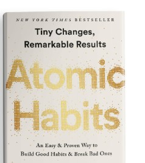

# Week 01 — Success Mindset (Mindset OS)

Part of the DevOps Micro Internship (DMI) Cohort 3 with Agentic AI

---

## Purpose (Read This First)

This week is not motivation homework.

This is you building your **Mindset OS** — the system you will use for the next 5 months (and honestly, for years).

### Expectations

* Be honest.
* Be specific.
* Be practical.
* Write like an adult professional: clear sentences, no one-liners.

You will reuse this in later weeks. So do it properly once.

---

# Assignment 1. What is something you believe to be true that most people around you would disagree with?

### Rules

* No "safe" answers.
* Must be your real belief (not copied from internet).
* Minimum 50 words.

**Hint:** What do you believe about career, money, learning, discipline, relationships, health, success, life, tech industry, etc. that most people don't agree with?

## Answer

One thing I believe that many people around me disagree with is that girls can support their parents even after marriage, both financially and emotionally. I was born and brought up in a remote village where many people believe that girls do not need higher education because they will get married and become part of another family. However, I strongly believe that educating girls benefits both families and society. A daughter can take care of her parents, help them financially, and stand by them during difficult times just as much as a son can. Marriage should not reduce a woman's responsibility or love for her parents

---

# Assignment 2. What are the top 3 objective truths you discovered through experimentation and results?

### Definition

Objective truths do not depend on opinions. They hold true regardless of how people feel.

Write each truth in this format:

**Truth:** (1 sentence)

**Evidence from my life:** (2–4 lines: what you tried + what happened)

---

## Truth #1

### Truth

Smart work needs than hard work

### Evidence from my life

When I started working, one of my college used to come up with same kind of idea ,but he used a smart way to present it ,which is he present his idea first. Its a smart move.

---

## Truth #2

### Truth

Proper sleep directly improves productivity.

### Evidence from my life

When I am in any troubles, I used to get good sleep and wakeup early. So that my brain works brightly. I witnessed multiple times, I get ideas after good sleep

---

## Truth #3

### Truth

Learning by doing is more effective than learning only through theory

### Evidence from my life

I wanted to learn coding, I started learning theories .I watched multiple youtube videos and browsed various sites.But when I started with small codes 
---

# Assignment 3. What does your 2.0 version look like?

### Instructions

Write as if a journalist is writing about you **3 to 7 years from now** (not 20 years).

**Minimum 300 words.**

### Rules

* Write in past tense, like it already happened.
* Don't use "likes to / wants to / hopes to."
* Use specifics:

  * built
  * shipped
  * led
  * published
  * earned
  * relocated
  * contributed
* Include skills proof:

  * projects
  * portfolios
  * GitHub
  * blogs
  * certifications
  * job role
  * leadership
  * community contribution
* Add 1–3 images if you can (optional but powerful).

### Publish It Publicly On Any ONE

* LinkedIn
* Medium
* WordPress
* Blogspot
* Personal blog
* Portfolio page

Include this line:

> **P.S. This post is a part of DevOps Micro Internship with Agentic AI Cohort-3 by [Pravin Mishra](https://www.linkedin.com/in/pravin-mishra-aws-trainer/). You can start your DevOps journey by joining this [Discord community](https://discord.pravinmishra.com/) ( https://discord.pravinmishra.com/ ).**

## Your Article

Version 2.0 -Blessy
Blessy S had quietly become one of the most reliable names in site reliability engineering circles, known for turning fragile systems into resilient, scalable platforms. Over the past five years, she built and shipped multiple high-impact automation frameworks that significantly reduced incident response times across distributed systems.
Her journey was not linear. Following a layoff early in her career, Blessy faced a challenging period marked by uncertainty and setbacks, including difficulties in securing a new role and building a professional presence on LinkedIn. However, she adapted quickly to the industry’s shift toward AI-driven operations, repositioning herself with new skills and a renewed focus. What began as a period of exhaustion and self-doubt became a defining pivot toward growth and resilience.
As she re-established her path in site reliability engineering, Blessy led the design and implementation of an end-to-end observability platform integrating Prometheus, Grafana, and OpenTelemetry. The platform delivered real-time insights into application performance and reduced Mean Time to Resolution (MTTR) by more than 40%.She built Git repositories, which gained strong traction among engineers,
She earned advanced certifications, Certified Kubernetes Administrator (CKA), proving her expertise in cloud-native reliability practices. Recently ,she relocated briefly to a global engineering hub for a cross-functional leadership role, where she led a team of 12 engineers managing large-scale production environments serving millions of users daily.
Blessy also published technical blogs and case studies on scaling microservices, incident postmortems, and cost optimization strategies. Her articles were featured on developer platforms and cited within engineering communities for their practical value. 
Beyond technical contributions, she mentored junior engineers and actively contributed to the SRE community by organizing internal workshops, speaking at meetups, and guiding open-source contributors. Her leadership style was grounded in clarity, accountability, and continuous improvement.
Now, Blessy had built not just systems, but trust—earning recognition within her organization as a go-to expert during critical incidents. She contributed to defining reliability standards that became foundational across teams.
Her 2.0 version was not defined by titles alone, but by impact: systems that stayed up, teams that grew stronger, and knowledge that scaled beyond her immediate circle.

### Public Link

Paste your link here:

<<<<<<< HEAD
`https://www.linkedin.com/posts/share-7478122147031248896--UHq/?utm_source=share&utm_medium=member_desktop&rcm=ACoAAEG6aBMB0zfBR9hQTWrl7i6zZCygzNyvY74`
=======
`Add your URL here`
>>>>>>> upstream/main

---

# Assignment 4. Have you ever cut corners (unethical / dishonest / shortcut behavior — not necessarily illegal)? If yes, how did it make you feel?

### Important

You don't need to write the full story.

Focus on the feeling:

* guilt
* fear
* shame
* stress
* regret
* numbness
* etc.

This is about self-awareness, not judgment.

### Answer Format

**Yes / No**

If Yes:

**What emotion did you feel?** (minimum 50–100 words)

## Answer

I felt guilty, stressed, and worried after taking a shortcut instead of doing things in the right way. Even though it may have saved time in the beginning, I kept thinking about whether I had made the correct decision. The feeling of not being completely honest made me uncomfortable and affected my peace of mind. I also felt regret because I realized that doing things properly, even if it takes more effort, gives better satisfaction and confidence. This experience taught me that integrity and honesty are important, and shortcuts are often not worth the emotional burden they create.
Making shortcuts sometimes save times ,but in long run it feels too guilty and some times by skipping the task genuinely missed some opportunities as well.

---

# Assignment 5. What are 10 non-fiction books you plan to read in the next 1 year?

### Rules

* Mention **Title + Author**
* Any language allowed
* No fiction novels

### Tip

Choose books that improve:

* mindset
* communication
* productivity
* health
* money
* career
* leadership

## Book List

1. No Linits - Mukesh Bandsal

2. Ikigai: The Japanese Secret to a Long and Happy Life – Héctor García and     Francesc Miralles

3. Wings of Fire – A. P. J. Abdul Kalam and Arun Tiwari

4. The Monk Who Sold His Ferrari – Robin Sharma
5. Life's Amazing Secrets – Gaur Gopal Das
6. Connect the Dots – Rashmi Bansal
7. The Lean Startup – Eric Ries
8. Zero to One – Peter Thiel
9. Atomic Habits – James Clear

10. Build, Don't Talk – Raj Shamani

---

# Assignment 6. What are the things you will measure regularly in your life and career?

### Rules

List topics only. No need to share numbers.

### Must Include

* Learning / skill
* Output / proof
* Health / energy
* Time / focus
* Money / finance (personal or business)

### Example

* Learning hours per week
* Deep work sessions per week
* Projects shipped / documented
* Steps / workouts
* Sleep hours
* Spending tracker

## My Metrics

* Screen time
* Sleep hours
* Workouts per week
* Daily steps
* Monthly savings
* Emergency fund status
* Certifications completed
* New skills acquired
* Learning hours per week
* My weight

---

# Assignment 7. Brain Dump + 5-Month System Plan

## Step 1: Brain Dump (Private)

Do a brain dump of everything in your mind into a notebook.

Examples:

* Bills
* Tasks
* Worries
* Goals
* Pending messages
* Ideas
* Responsibilities

### Did You Do It?

**Yes **

Answer:
I do write my brain journeys into notebook.I might include task to complete, my goals, ideas ,any pending works and responsibilities 

---

## Step 2: Your 5-Month Routine + Focus Blocks

Create a simple plan you can realistically follow for the next 5 months.

### Weekly Routine

Example:

* Mon–Thu: 60 min deep work
* Sat: DMI session
* Sun: Weekly review

#### My Weekly Routine

Monday – Thursday: 60–90 min deep work/45–60 min project building/15 min notes
Friday: Revision
Sat:DMI session
Sunday: Church /Family time /Community learning 

---

### Focus Blocks

#### When Will You Do DMI Work? (Days + Time)

Monday – Thursday: 11:00 AM IST – 1:00 PM IST
#### How Many Sessions Per Week?

4 weekday sessions for project submission and 8hours longer Saturday sessions

---

### Distraction Rules

Examples:

* Phone rules
* Social media rules
* Environment setup

#### My Distraction Rules

Keep my phone away when I am in serious studies 
Cut down social media usage

---

# Reflection – Week 1

### Biggest insight I got about myself this week

Consistency matters more than motivation, and even small focused sessions helped me make real progress.

### My biggest weakness/loop I noticed

I noticed a pattern of overthinking and delaying execution, especially when tasks feel difficult or unclear.

### One system I will implement from this week (exact habit + time)
I will do 1 hour of distraction-free deep work every weekday from 7:00 PM to 8:00 PM

### LinkedIn Post

Paste your LinkedIn post link here:

<<<<<<< HEAD
`https://www.linkedin.com/posts/blessy-s-06b379269_devops-devopsmicrointernship-agenticai-activity-7478403128309207040-H3Ye?utm_source=share&utm_medium=member_desktop&rcm=ACoAAEG6aBMB0zfBR9hQTWrl7i6zZCygzNyvY74`
=======
`Add your URL here`
>>>>>>> upstream/main

---

## 10. Proof of Work

- LinkedIn Post URL: https://www.linkedin.com/posts/blessy-s-06b379269_devops-devopsmicrointernship-agenticai-activity-7478403128309207040-H3Ye?utm_source=share&utm_medium=member_desktop&rcm=ACoAAEG6aBMB0zfBR9hQTWrl7i6zZCygzNyvY74  
- Blog / Medium : https://medium.com/@blessys2010/week-1-of-my-devops-micro-internship-journey-741e363f308f?sharedUserId=blessys2010

---

## 📌 About DMI & CloudAdvisory

DevOps Micro Internship (DMI) is a project-based DevOps program run by Pravin Mishra (The CloudAdvisory) focused on real-world execution, systems thinking, and career readiness.

It helps learners build strong DevOps foundations with hands-on experience.

## 📌 Resources

- 🌐 **DMI Official Website:** https://pravinmishra.com/dmi  
- 🎓 **DevOps for Beginners (Udemy):** https://www.udemy.com/course/devops-for-beginners-docker-k8s-cloud-cicd-4-projects/  
- 🎓 **Ultimate Agentic AI DevOps with Clude Code** https://www.udemy.com/course/ultimate-agentic-ai-devops-with-claude-code/?referralCode=448389767BC96284087B
- 🎓 **DevOps with Claude Code: Terraform, EKS, ArgoCD & Helm** https://www.udemy.com/course/devops-with-claude-code-terraform-eks-argocd-helm/?referralCode=1C5B734505D65A010FA3
- ▶️ **YouTube Playlist (DMI Cohort 3):** https://www.youtube.com/playlist?list=PLFeSNDtI4Cho  
- 🔗 **Pravin Mishra (LinkedIn):** https://www.linkedin.com/in/pravin-mishra-aws-trainer/  
- 🏢 **CloudAdvisory (LinkedIn):** https://www.linkedin.com/company/thecloudadvisory/

---

*This submission is part of DevOps Micro Internship (DMI) Cohort 3 — Agentic AI Track*