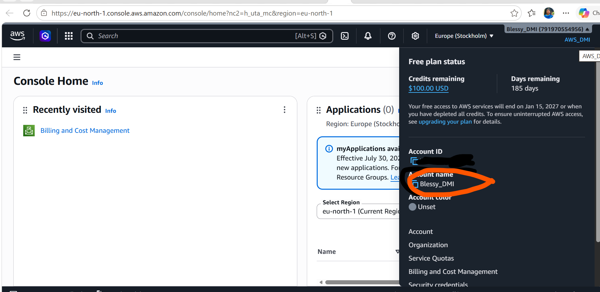

# Assignment 1 — AWS Free Tier Account Setup (EpicReads Cloud Onboarding)

Part of the DevOps Micro Internship (DMI) Cohort 3 with Agentic AI

---

## Purpose

In this assignment, you will create and verify an AWS Free Tier account as part of onboarding EpicReads — an online bookstore moving to the cloud. You will demonstrate an understanding of AWS fundamentals, Free Tier services, and account setup by answering conceptual questions and capturing proof of a working AWS Console login.

---

# Task 1 — Understanding AWS & Free Tier

## Goal

Demonstrate understanding of AWS basics and Free Tier usage by answering the following questions in your own words (3–4 lines each).

### Answers

#### Question 1 — What is an AWS account, and why do you need it at this stage?

An AWS account is a unique identity that allows an individual or organization to access Amazon Web Services (AWS). It provides access to cloud services such as Amazon EC2, Amazon S3, Amazon RDS, and many others, while also managing resource usage and billing.
At this stage of the DMI, an AWS account is essential because we need a real cloud environment to practice.An AWS Free Tier account allows students to experiment with cloud services at little to no cost while building practical skills

---

#### Question 2 — What is AWS Free Tier, and how long does it last?

The AWS Free Tier is a program offered by Amazon Web Services (AWS) that allows users to explore, learn, and experiment with cloud services at little or no cost.

When you create a new AWS Free Tier account, you get $100 in credits immediately. As you explore key services, you can earn up to $100 more. That's up to $200 over 6 months to build, break things, and experiment with no charges and no surprise bills on the Free plan. The account closes on its own 6 months after you open it or when your credits run out, whichever comes first. You won’t be charged unless you convert to a Paid plan.
--------

#### Question 3 — Name three AWS Free Tier services and their free usage limits.

Amazone Ec2 -Use credits to access Amazon EC2 features in  Free plans. Free plan eligible instances include:T3.micro, T3.small, T4g.micro, T4g.small, C7i-flex.large, M7i-flex.large
Amazon S3-Use credits to access Amazon S3 features in both Free plan.
Amazon RDS:Use credits to access Amazon RDS features in  Free plans. Free plan eligible instances include:db.t3.micro and db.t4g.micro and 4 engines: MySQL, PostgreSQL, MariaDB, and Microsoft SQL Server

---

# Task 2 — Create AWS Free Tier Account

## Goal

Create a valid AWS Free Tier account and sign in to the AWS Management Console.

> No screenshots required for this task. Completion is verified through Task 3.

---

# Task 3 — Verify AWS Account

## Goal

Confirm that your AWS account setup is complete by navigating to the Account section and capturing proof.

### Evidence

#### Screenshot 1 — AWS Account page showing account name (email may be blurred)

---

# Submission Instructions

- Add all required screenshots in your GitHub repository submission
- Full name must be visible in required screenshots
- Do not expose sensitive information (keys, passwords, account IDs)

---

# Completion Checklist

- [ ] Task 1 answers written in own words
- [ ] AWS Free Tier account created successfully
- [ ] Signed in to AWS Management Console
- [ ] Screenshot of AWS Account page captured (full name visible, no sensitive data)
- [ ] All required screenshots added to repository

---

## 📌 About DMI & CloudAdvisory

DevOps Micro Internship (DMI) is a project-based DevOps program run by Pravin Mishra (The CloudAdvisory) focused on real-world execution, systems thinking, and career readiness.

It helps learners build strong DevOps foundations with hands-on experience.

---

## 📌 Resources

- 🌐 DMI Official Website: https://pravinmishra.com/dmi  
- 🎓 DevOps for Beginners (Udemy): https://www.udemy.com/course/devops-for-beginners-docker-k8s-cloud-cicd-4-projects/  
- 🎓 Agentic AI DevOps with Claude Code: https://www.udemy.com/course/ultimate-agentic-ai-devops-with-claude-code/  
- 🎓 DevOps with Claude Code: Terraform, EKS, ArgoCD & Helm: https://www.udemy.com/course/devops-with-claude-code-terraform-eks-argocd-helm/  
- ▶️ YouTube Playlist: https://www.youtube.com/playlist?list=PLFeSNDtI4Cho  
- 🔗 Pravin Mishra (LinkedIn): https://www.linkedin.com/in/pravin-mishra-aws-trainer/  
- 🏢 CloudAdvisory (LinkedIn): https://www.linkedin.com/company/thecloudadvisory/

---

*This submission is part of DevOps Micro Internship (DMI) Cohort 3 — Agentic AI Track.*