# Assignment 3 — Production Maintenance Drill (OPS Checklist)

Part of the DevOps Micro Internship (DMI) Cohort 3 with Agentic AI

---

## Purpose

In this assignment, you will treat your already deployed React application (on Ubuntu VM with Nginx) as a live production system. You will perform structured operational checks covering network validation, service health, log analysis, resource monitoring, configuration verification, and incident simulation with recovery — mirroring real on-call DevOps responsibilities.

---

# Task 1 — Server Access & Networking Validation

## Goal

Verify that the deployed React application is reachable from the browser and confirm basic network connectivity of the Ubuntu VM.

### Evidence

#### Screenshot 1 — Browser showing the React app with your Full Name visible on the UI

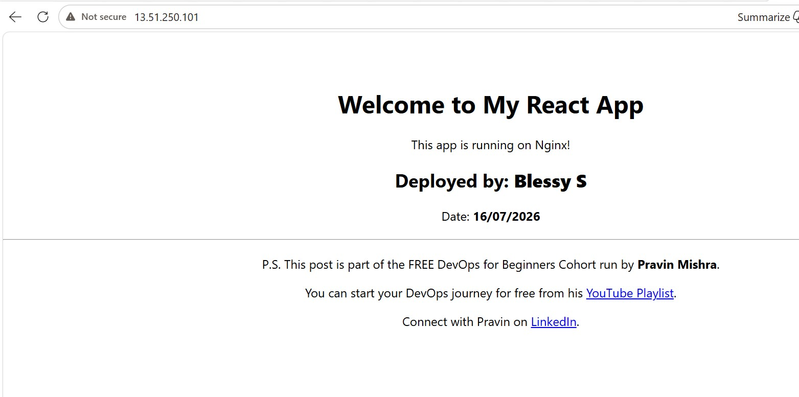

---

#### Screenshot 2 — Output of `ip a`

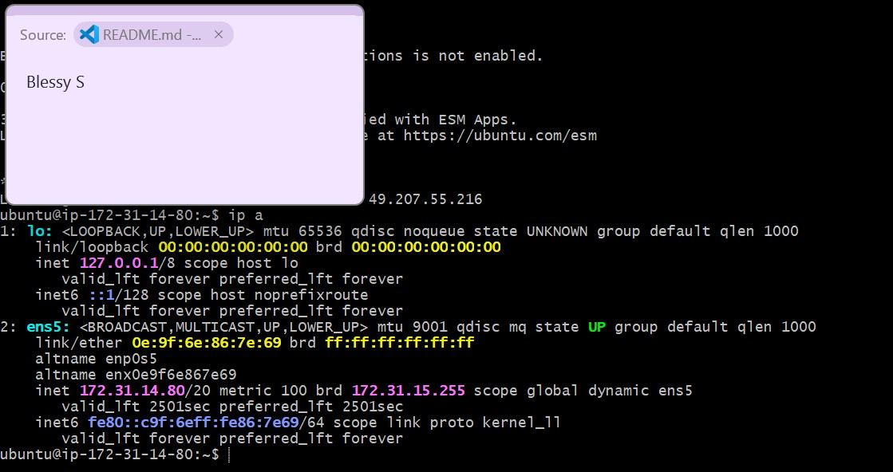

---

#### Screenshot 3 — Output of `sudo ss -tulpen`

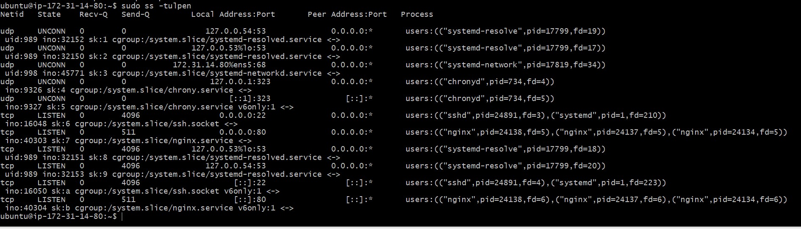

---

#### Screenshot 4 — Output of `sudo ufw status`

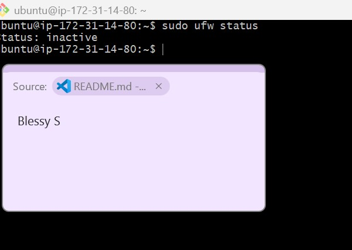.

---

### Notes

Answer the following in your own words:

**1. What proves Nginx is listening on 0.0.0.0:80?**

From the command `sudo ss -tulpen` ,its evident that nginx runs on port 80 and accept all traffic from external, other than localhost ,which is evident from 0.0.0.0

```ubuntu@ip-172-31-14-80:~$ sudo ss -tulpen |grep nginx
tcp   LISTEN 0      511              0.0.0.0:80        0.0.0.0:*    users:(("nginx",pid=24138,fd=5),("nginx",pid=24137,fd=5),("nginx",pid=24134,fd=5)) ino:40303 sk:7 cgroup:/system.slice/nginx.service <->
tcp   LISTEN 0      511                 [::]:80           [::]:*    users:(("nginx",pid=24138,fd=6),("nginx",pid=24137,fd=6),("nginx",pid=24134,fd=6)) ino:40304 sk:b cgroup:/system.slice/nginx.service v6only:1 <->
ubuntu@ip-172-31-14-80:~$
```

---

**2. What proves SSH is active on port 22?**

From command `sudo ss -tulpen |grep ssh` , I see 22 as portnumber for ssh
```
ubuntu@ip-172-31-14-80:~$ sudo ss -tulpen |grep ssh
tcp   LISTEN 0      4096             0.0.0.0:22        0.0.0.0:*    users:(("sshd",pid=24891,fd=3),("systemd",pid=1,fd=210))                           ino:16048 sk:6 cgroup:/system.slice/ssh.socket <->
tcp   LISTEN 0      4096                [::]:22           [::]:*    users:(("sshd",pid=24891,fd=4),("systemd",pid=1,fd=223))                           ino:16050 sk:a cgroup:/system.slice/ssh.socket v6only:1 <->
ubuntu@ip-172-31-14-80:~$
```
---

**3. Did you find any unexpected open ports? Explain briefly.**

When I filtered ssh and nginx except I see few services ,which are chronyd (time sync) and systemd-resolved (DNS resolution), and its ip addresses are loopback adress starts from 127 ip.

```
ubuntu@ip-172-31-14-80:~$ sudo ss -tulpen |grep -v ssh | grep -v nginx
Netid State  Recv-Q Send-Q     Local Address:Port Peer Address:PortProcess                                                                                                  
udp   UNCONN 0      0             127.0.0.54:53        0.0.0.0:*    users:(("systemd-resolve",pid=17799,fd=19))                                        uid:989 ino:32152 sk:1 cgroup:/system.slice/systemd-resolved.service <->
udp   UNCONN 0      0          127.0.0.53%lo:53        0.0.0.0:*    users:(("systemd-resolve",pid=17799,fd=17))                                        uid:989 ino:32150 sk:2 cgroup:/system.slice/systemd-resolved.service <->
udp   UNCONN 0      0      172.31.14.80%ens5:68        0.0.0.0:*    users:(("systemd-network",pid=17819,fd=36))                                        uid:998 ino:47706 sk:c cgroup:/system.slice/systemd-networkd.service <->
udp   UNCONN 0      0              127.0.0.1:323       0.0.0.0:*    users:(("chronyd",pid=734,fd=4))                                                   ino:9326 sk:4 cgroup:/system.slice/chrony.service <->
udp   UNCONN 0      0                  [::1]:323          [::]:*    users:(("chronyd",pid=734,fd=5))                                                   ino:9327 sk:5 cgroup:/system.slice/chrony.service v6only:1 <->
tcp   LISTEN 0      4096       127.0.0.53%lo:53        0.0.0.0:*    users:(("systemd-resolve",pid=17799,fd=18))                                        uid:989 ino:32151 sk:8 cgroup:/system.slice/systemd-resolved.service <->
tcp   LISTEN 0      4096          127.0.0.54:53        0.0.0.0:*    users:(("systemd-resolve",pid=17799,fd=20))                                        uid:989 ino:32153 sk:9 cgroup:/system.slice/systemd-resolved.service <->
ubuntu@ip-172-31-14-80:~$

```

---

# Task 2 — Service Health & Systemd Validation (Nginx)

## Goal

Verify that Nginx is properly installed, running, enabled at boot, and safely configured.

### Evidence

#### Screenshot 1 — Output of `systemctl status nginx --no-pager`

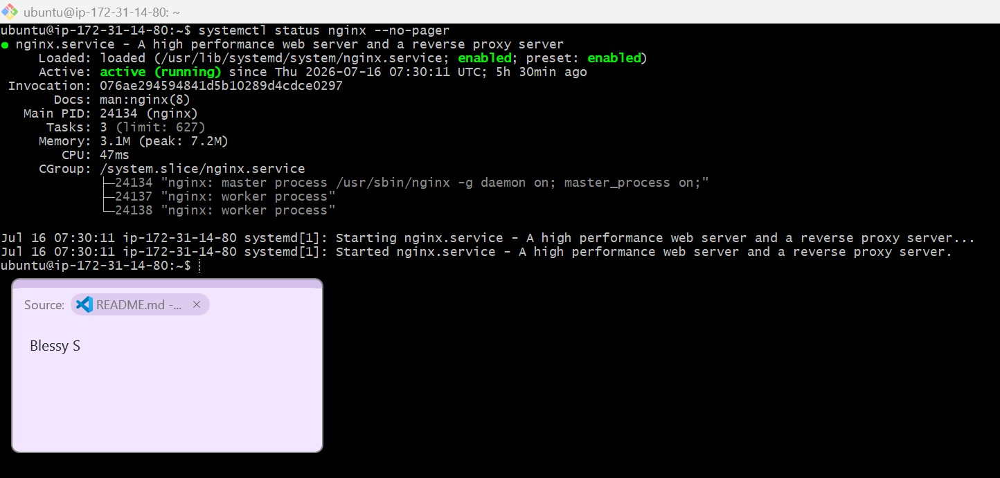

---

#### Screenshot 2 — Output of `sudo nginx -t`

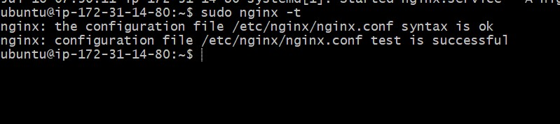

---

#### Screenshot 3 — Output of `sudo ss -lptn '( sport = :80 )'`

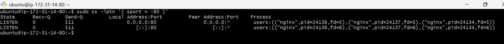

---

### Notes

Answer the following in your own words:

**1. What happens if Nginx fails to restart in production?**

If nginx fails to start , then react application url will not load. Because ,nginx listen on 80 port , if nginx service is in inactive, 80 port will not listen

---

**2. What's your basic rollback plan?**

Troubleshooting steps are :
1)run `sudo nginx -t` first to validate the config syntax 
2)check `systemctl status nginx --no-pager`
3)`sudo journalctl -u nginx --no-pager -n 50` ..>which shows errors

---

# Task 3 — Logs & Request Trace

## Goal

Verify real traffic flow and analyze logs to understand system behavior and errors.

### Evidence

#### Screenshot 1 — Output of `sudo tail -n 30 /var/log/nginx/access.log`

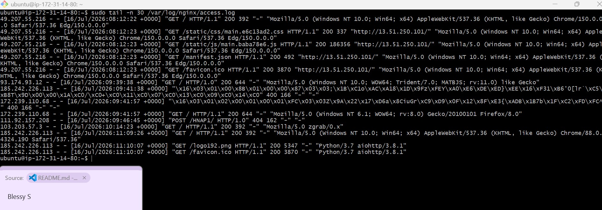

---

#### Screenshot 2 — Output of `sudo tail -n 30 /var/log/nginx/error.log`

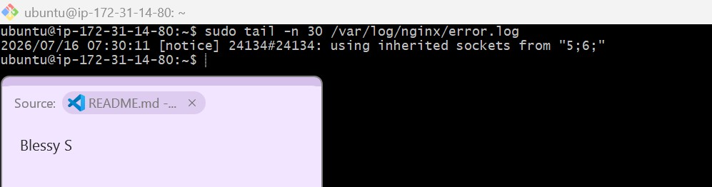

---

#### Screenshot 3 — Output of `sudo journalctl -u nginx --no-pager -n 50`

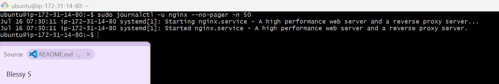

---

### Notes

Answer the following in your own words:

**1. Were there any errors in the logs?**

- If yes, mention 1–2 example error lines from the logs and explain what each one means in simple terms.
- If no, explain what it means if the error log is empty or shows no recent errors during your check.

There is no error in error.log file or journalctl command

---

**2. If there were no errors, what does that indicate about the system?**

If there is no error ,means nginx not encontered any issue related to configurations,services or internal errors.

---

**3. Based on the access logs, were your curl requests visible in the log entries? What does that prove about traffic flow?**

Yes, Access logs capture curl output as below 

```
13.51.250.101 - - [16/Jul/2026:13:44:19 +0000] "GET / HTTP/1.1" 200 644 "-" "curl/8.18.0"
13.51.250.101 - - [16/Jul/2026:13:44:58 +0000] "GET / HTTP/1.1" 200 644 "-" "curl/8.18.0"
```
200 in the status indicate its successful.
GET- means , request get from server own IP 13.51.250.101

This message indicates that from server ip itself curl command executed with GET functionality , and it hits nginx ,and processed correctly with 200 message.Later this communication logged in access.log file

---

# Task 4 — System Resource Health Check (Capacity Red Flags)

## Goal

Assess server capacity and detect potential performance or failure risks.

### Evidence

#### Screenshot 1 — Output of `uptime`

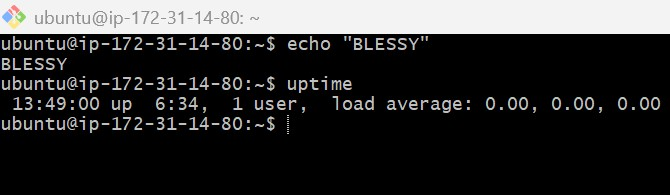

---

#### Screenshot 2 — Output of `free -h`

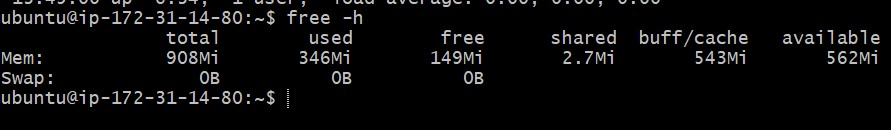

---

#### Screenshot 3 — Output of `df -h`

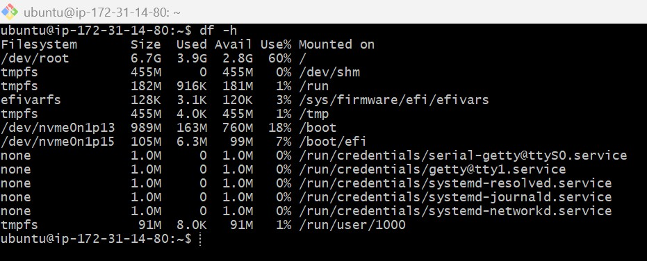

---

#### Screenshot 4 — Output of `sudo du -sh /var/* | sort -h`

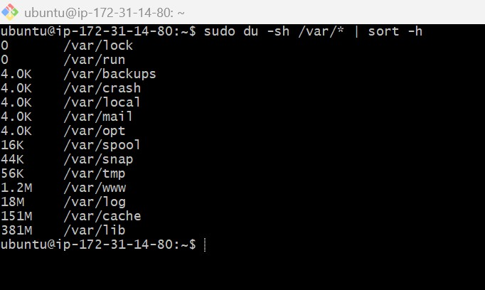

---

### Notes

Answer the following in your own words:

**1. Which resource looks most critical right now? (CPU/load, memory, or disk) Explain why.**

All the 3 resource CPU,memory RAM and disp space seems to be fine and not in any critical stage.

---

**2. What happens if disk becomes 100% full in a production server?**

If disk becomes 100% full mean,no other file can write to the disk.Usually log file need space to write into such files.If its realted to system such as / , means ssh to system may fail.

---

# Task 5 — Configuration & Deployment Verification

## Goal

Ensure the correct React build is deployed and Nginx is serving it properly.

### Evidence

#### Screenshot 1 — Output of `ls -lah /var/www/html | head -n 20`

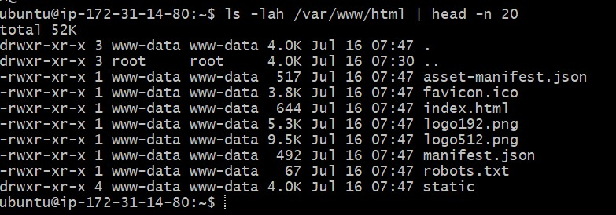

---

#### Screenshot 2 — Output of `grep -R "Deployed by" -n /var/www/html 2>/dev/null | head`

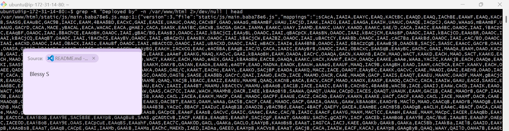

---

#### Screenshot 3 — Output of `grep -n "try_files" /etc/nginx/sites-available/default`

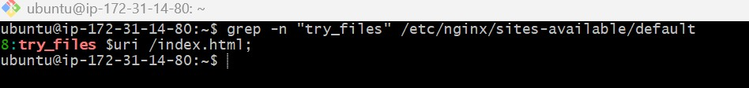

---

### Notes

Answer the following in your own words:

**1. How do you confirm that the correct version of the application is deployed?**

Correct application version can be checked by below steps
1. `ls -lah /var/www/html` confirmed the presence index.html file
2.`grep -R "Deployed by" -n /var/www/html` help to understand correct specific custom identifying text was compiled into the live JavaScript bundle.
3.`grep -n "try_files" /etc/nginx/sites-available/default` help to identify correct fallback ocnifguration in default file for unmatched routes
4.Curl test to understand site url is correctly accessible

---

# Task 6 — Nginx Configuration Failure Simulation

## Goal

Simulate a real-world Nginx misconfiguration and recover the service safely.

### Evidence

#### Screenshot 1 — Output of `sudo nginx -t` showing the syntax error (broken config)

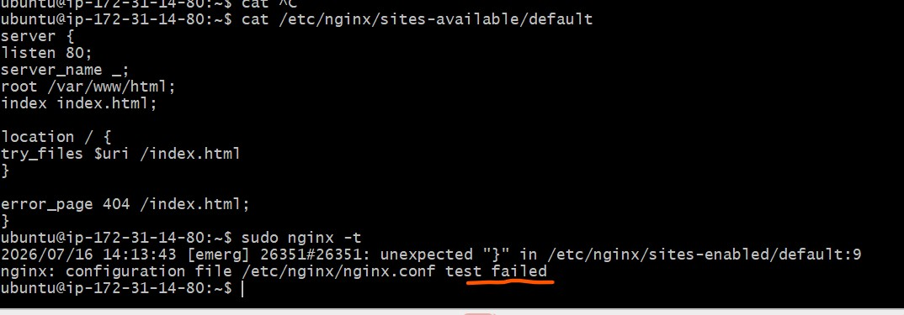

---

#### Screenshot 2 — Output of `sudo nginx -t` showing syntax ok (fixed config)

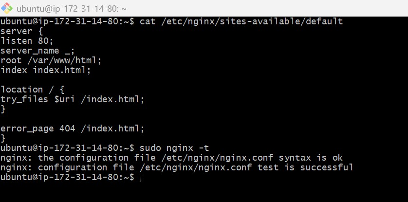

---

#### Screenshot 3 — Output of `curl -I http://<public-ip>` confirming recovery (200 OK)

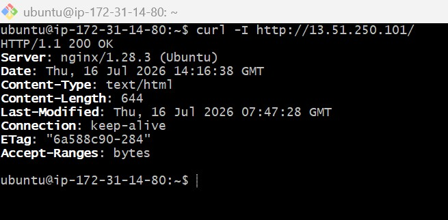

---

### Notes

Answer the following in your own words:

**1. What caused the configuration failure?**

Syntax error in the configuration fail caused the failure.

---

**2. How did you fix the issue?**

Corrected the syntax error by adding ; in the default file corrected the syntax issue. After that `sudo nginx -t` shows successful.

---

**3. How can you avoid this kind of issue in real production systems?**

1.Always run nginx -t after any config edit and verify all correct
2.Always keep configuration files in Git ,so that any old version can be reverted if any mistake happen and deleted or misconfigured files
3.Do changed in lower environment before doing in production
4.Add automation to execute changes.

---

# Task 7 — Web Application Failure Simulation

## Goal

Simulate missing deployment content and recover the application safely.

### Evidence

#### Screenshot 1 — Output of `curl -I http://<public-ip>` showing failure (non-200 response)

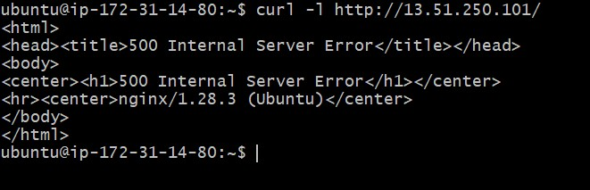

---

#### Screenshot 2 — Output of `curl -I http://<public-ip>` confirming recovery (200 OK)

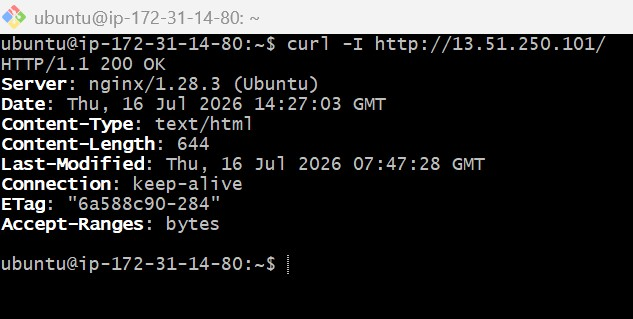

---

### Notes

Answer the following in your own words:

**1. What caused the application to break in this scenario?**

The web root directory (/var/www/html) become empty and it caused 500 internal error.

---

**2. How did you fix the issue and restore the application?**

Restored the /var/www/html folder with old content ,which give correct content to the react application to work.

---

**3. What steps would you take to prevent this kind of issue in real production systems?**

1. Backup the essecntial folders and files before doing a deployment can help to easily reverse the any failed release.

---

# Task 8 — Security & Reliability Review

## Goal

Review and reflect on the security and reliability practices applied during this assignment.

### Security & Reliability Notes

Answer the following in your own words:

**1. Why is SSH key-based authentication more secure than sharing passwords?**

SSH key-based authentication uses a public/private key pair instead of a password. The private key stays on the client and is never transmitted to the server.During authentication, the server verifies a cryptographic signature using the public key.It also enables secure automated access without exposing passwords
Password will be more exposed then ssh keys.

---

**2. Why should only required ports be open on a production server?**

Only the required ports should be open on a production server because every open port is a potential entry point for attackers.

---

**3. Why is it important for Nginx to be enabled on boot?**

Nginx to be enabled on boot, so that the web server starts automatically whenever the server boots or reboots.

---

**4. What are the risks of sharing secrets, keys, or credentials publicly?**

Sharing secrets, keys, or credentials publicly is a major security risk because anyone who obtains them may gain unauthorized access to  systems.

---

**5. Why should cloud resources be stopped or terminated when they are no longer needed?**

Because ,it may cause chanrges as we uses. So terminate the instance is the best way to reduce the bills and usages.

---

# LinkedIn Post (Required)

## Evidence

#### LinkedIn Post URL

Paste your LinkedIn post URL here:

`https://www.linkedin.com/posts/activity-7483435177814327297-upwb?utm_source=share&utm_medium=member_desktop&rcm=ACoAAEG6aBMB0zfBR9hQTWrl7i6zZCygzNyvY74`

---

#### Screenshot — Published LinkedIn post

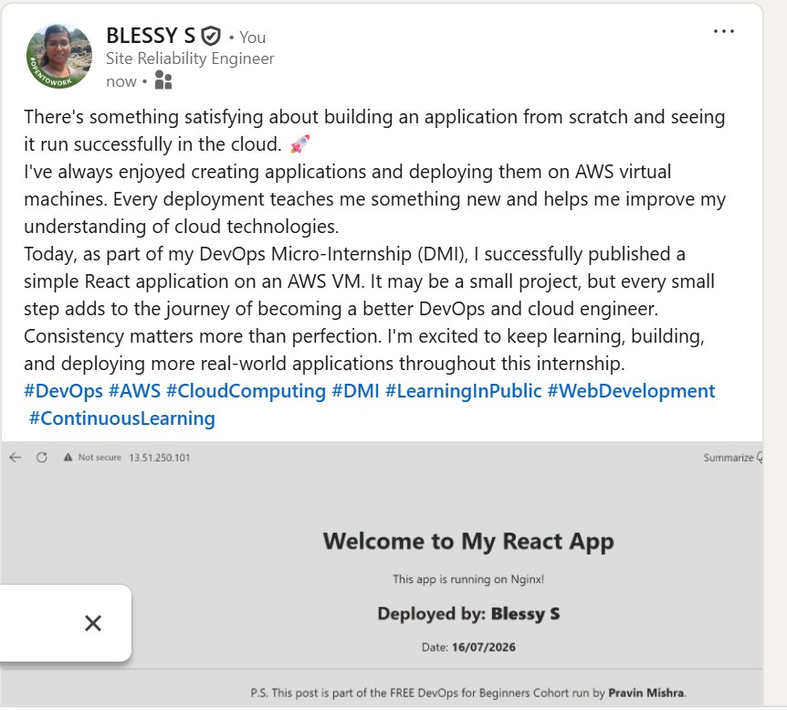

---

# Submission Instructions

- Add all required screenshots in your submission
- Full name must be visible in required screenshots
- Do not expose sensitive information (keys, passwords, account IDs)

---

# Completion Checklist

- [ ] Task 1: Screenshots (browser, ip a, ss -tulpen, ufw status) + Notes answered
- [ ] Task 2: Screenshots (nginx status, nginx -t, ss port 80) + Notes answered
- [ ] Task 3: Screenshots (access log, error log, journalctl) + Notes answered
- [ ] Task 4: Screenshots (uptime, free -h, df -h, du -sh) + Notes answered
- [ ] Task 5: Screenshots (ls html, grep deployed by, grep try_files) + Notes answered
- [ ] Task 6: Screenshots (nginx -t fail, nginx -t pass, curl recovery) + Notes answered
- [ ] Task 7: Screenshots (curl failure, curl recovery) + Notes answered
- [ ] Task 8: Security & Reliability Notes answered
- [ ] LinkedIn post published and URL submitted
- [ ] Full Name visible in all required screenshots
- [ ] No sensitive data exposed

---

## 📌 About DMI & CloudAdvisory

DevOps Micro Internship (DMI) is a project-based DevOps program run by Pravin Mishra (The CloudAdvisory) focused on real-world execution, systems thinking, and career readiness.

It helps learners build strong DevOps foundations with hands-on experience.

---

## 📌 Resources

- 🌐 DMI Official Website: https://pravinmishra.com/dmi  
- 🎓 DevOps for Beginners (Udemy): https://www.udemy.com/course/devops-for-beginners-docker-k8s-cloud-cicd-4-projects/  
- 🎓 Agentic AI DevOps with Claude Code: https://www.udemy.com/course/ultimate-agentic-ai-devops-with-claude-code/  
- 🎓 DevOps with Claude Code: Terraform, EKS, ArgoCD & Helm: https://www.udemy.com/course/devops-with-claude-code-terraform-eks-argocd-helm/  
- ▶️ YouTube Playlist: https://www.youtube.com/playlist?list=PLFeSNDtI4Cho  
- 🔗 Pravin Mishra (LinkedIn): https://www.linkedin.com/in/pravin-mishra-aws-trainer/  
- 🏢 CloudAdvisory (LinkedIn): https://www.linkedin.com/company/thecloudadvisory/

---

*This submission is part of DevOps Micro Internship (DMI) Cohort 3 — Agentic AI Track.*