# Assignment 5 — Bash Script Automation Drill (OPS Checklist)

Part of the DevOps Micro Internship (DMI) Cohort 3 with Agentic AI

---

## Purpose

In this assignment, you will practice Bash scripting by building a series of small automation scripts covering environment setup, variables, arrays, loops, file conditionals, if-else logic, and functions. These scripts form the foundation of real-world Linux automation used in DevOps, cloud, and production support environments.

---

# Task 1 — Bash Environment & Workspace Setup

## Goal

Verify that Bash is available on your system and create a clean workspace for this assignment.

### Evidence

#### Screenshot 1 — Output of `echo $SHELL` and `bash --version`

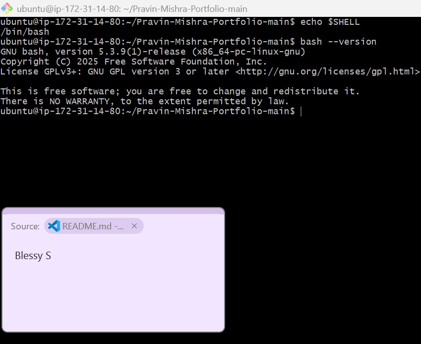

---

#### Screenshot 2 — Output of `pwd` and `ls -lah` showing the scripts directory

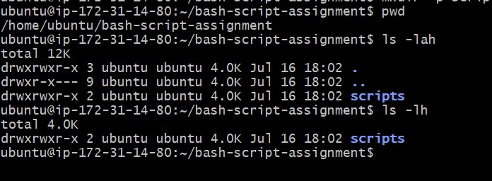

---

### Notes

Answer the following in your own words:

**1. What is Bash?**

Bash stands for Bourne Again Shell. It is the default command-line shell.It allows users to execute commands, manage files, run programs, and automate tasks using shell scripts

---

**2. What is the difference between shell and Bash?**

A shell is a program that provides a command-line interface between the user and the operating system.It is a generic term.There are many types of shells, such as Bash, Sh.Whereas ,Bash (Bourne Again Shell) is a specific type of shell.

Examples of Shells
....................
Bash (Bourne Again Shell)
Sh (Bourne Shell)
Zsh (Z Shell)
Ksh (Korn Shell)
Csh (C Shell)

---

**3. Why is it important to confirm the Bash version before writing scripts?**

because different Bash versions support different features. A script written for a newer version of Bash may not work on an older system.

---

# Task 2 — Your First Bash Script

## Goal

Create your first Bash script, make it executable, and run it from the terminal.

### Evidence

#### Screenshot 1 — Content of `first-script.sh`

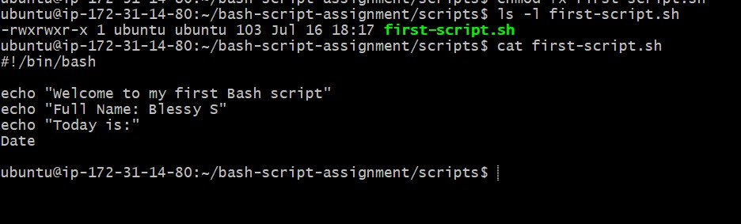

---

#### Screenshot 2 — Output of `./first-script.sh`

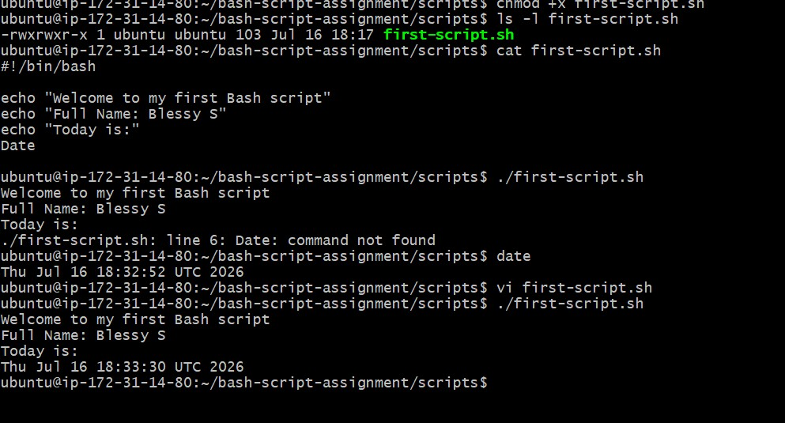

---

#### Screenshot 3 — Output of `ls -l first-script.sh` showing executable permission

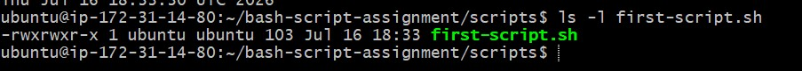

---

### Notes

Answer the following in your own words:

**1. What is the purpose of `#!/bin/bash`?**

`#!/bin/bash` is called the shebang line. It tells the operating system to use the Bash interpreter to run the commands inside the sh script

---

**2. Why do we use `chmod +x` before running a script?**

this command will change the executable permission of the file

---

**3. What is the difference between running a script using `./script.sh` and `bash script.sh`?**

./script.sh need executable permission to run the command ,whereas `bash script.sh` not needed executable permission to run it as it is a direct file run from bash shell.Bash shell only uses to execute the file even if the inside script has different shell.

---

# Task 3 — Variables: User Information Script

## Goal

Use variables to store and display user-related information.

### Evidence

#### Screenshot 1 — Content of `user-info.sh`

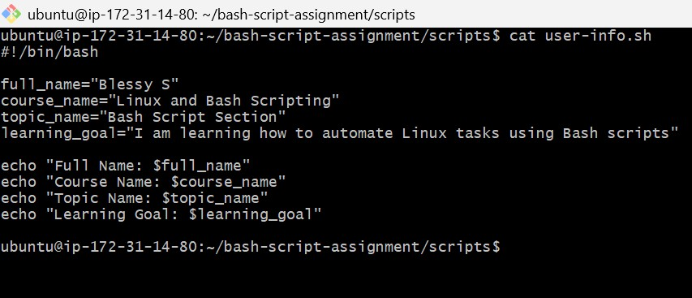

---

#### Screenshot 2 — Output of `./user-info.sh`

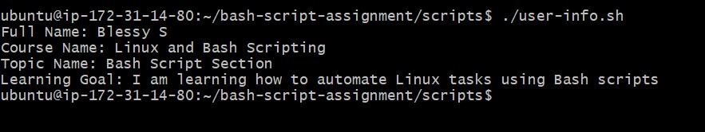
---

### Notes

Answer the following in your own words:

**1. What is a variable in Bash?**

Variable is a name used which can hold any data ,and its can be used multiple times in a script ,so that orginal data no need to use directly.

---

**2. Why should we avoid spaces around the `=` sign when creating variables?**

Bash does not allow spaces around the = sign when assigning a value to a variable. If add space ,then bash will treat it as a command.

---

**3. How do you access the value stored inside a Bash variable?**

We add the $ symbol before the variable name to access its stored value. 
Example:  
    `echo "$e_variable"`

---

# Task 4 — Arrays & Loops: Tools Checklist Script

## Goal

Use arrays and loops to print a checklist of tools used in Bash scripting.

### Evidence

#### Screenshot 1 — Content of `tools-checklist.sh`

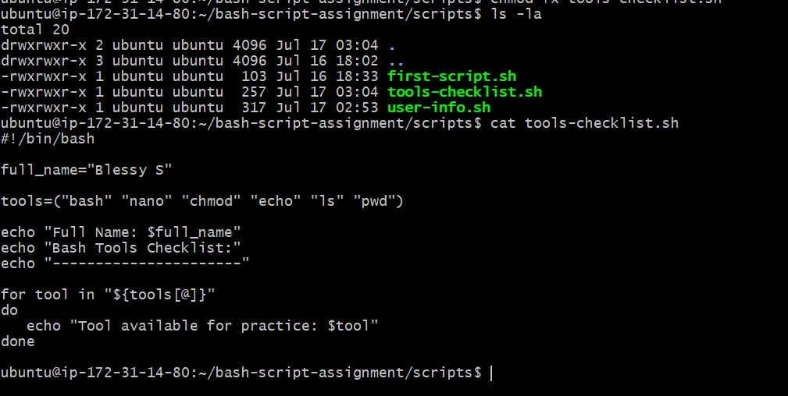

---

#### Screenshot 2 — Output of `./tools-checklist.sh`

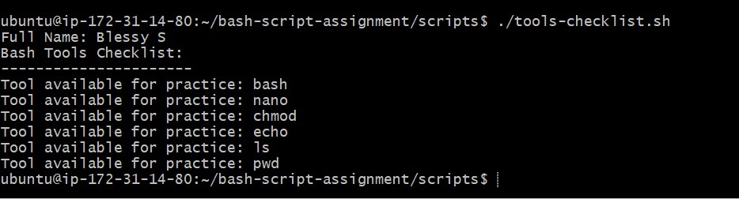

---

### Notes

Answer the following in your own words:

**1. What is an array in Bash?**

An array is used to store multiple values under one variable name.

---

**2. Why are arrays useful in scripts?**

Arrays allow us to keep related values together.

---

**3. What does `"${tools[@]}"` mean?**

It is used to access each values in tools array.

---

**4. What is the purpose of the `for` loop in this script?**

The for loop goes through each value in the tools array one by one.

---

# Task 5 — Loops: Number Counter Script

## Goal

Use loops to repeat a task multiple times.

### Evidence

#### Screenshot 1 — Content of `counter.sh`

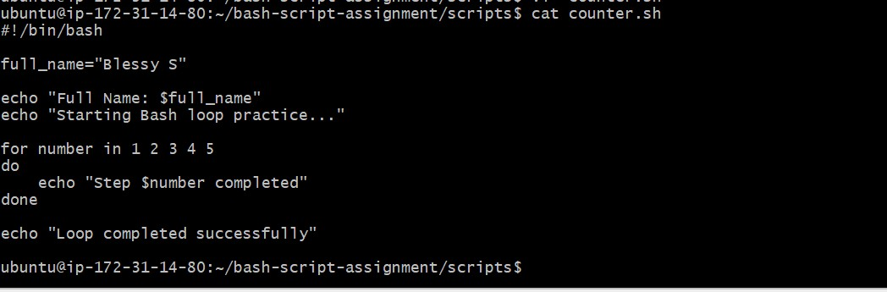

---

#### Screenshot 2 — Output of `./counter.sh`

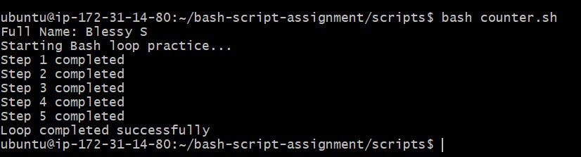

---

### Notes

Answer the following in your own words:

**1. What is a loop?**

Loop is a repeatable action ,add it execute multiple time.

---

**2. Why do we use loops in Bash scripting?**

A loop is used to repeat a task multiple times.Hence no need to write same ctask multiple time.

---

**3. How many times did the loop run in your script?**

Five times.

---

**4. What would you change if you wanted the loop to run 10 times?**

We need to add 6 to 10 numbers in `for`

---

# Task 6 — Files & Conditionals: File Validation Script

## Goal

Use file checks and conditionals to verify whether files and directories exist.

### Evidence

#### Screenshot 1 — Output of `ls -lah ../test-folder`

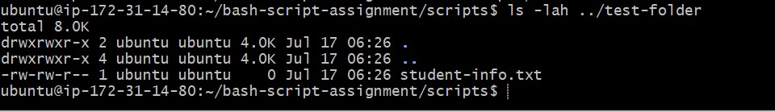

---

#### Screenshot 2 — Content of `file-check.sh`

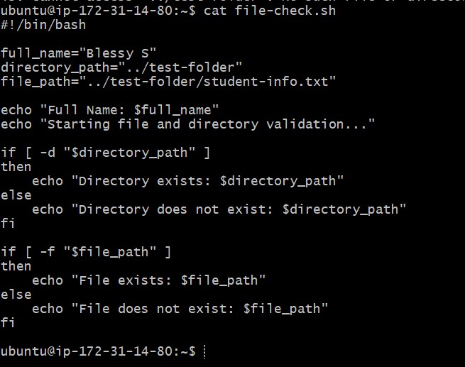

---

#### Screenshot 3 — Output of `./file-check.sh`

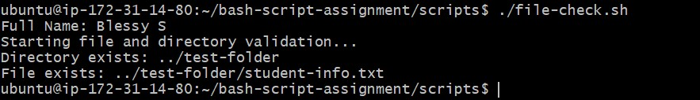

---

### Notes

Answer the following in your own words:

**1. What does `-d` check in Bash?**

The -d option checks whether the given path exists and whether it is a directory.

---

**2. What does `-f` check in Bash?**

`-f` indicates whether its a file exist

---

**3. Why should file and directory paths be stored in variables?**

Usage of variables make the script to be more structured to read and update.

---

**4. What happens if the file does not exist?**

if file doesnot exist , `-f` condition become false, so that else condition command will run.

---

# Task 7 — Conditionals: Pass or Retry Script

## Goal

Use if-else conditionals to make decisions based on a variable value.

### Evidence

#### Screenshot 1 — Content of `score-check.sh` with `score=85`

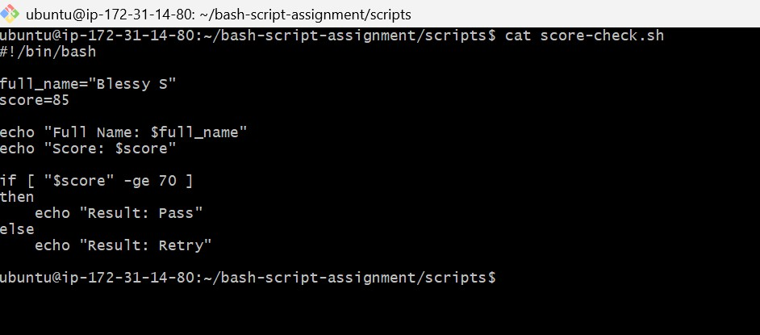

---

#### Screenshot 2 — Output showing `Result: Pass`

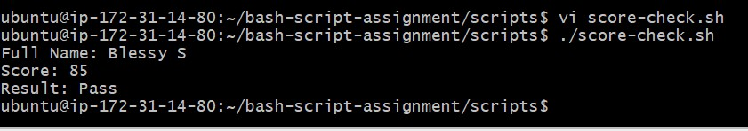

---

#### Screenshot 3 — Content of `score-check.sh` with `score=55`

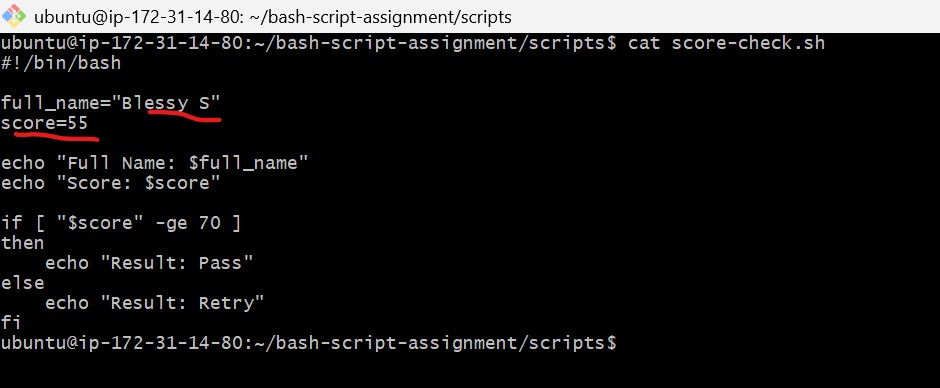

---

#### Screenshot 4 — Output showing `Result: Retry`

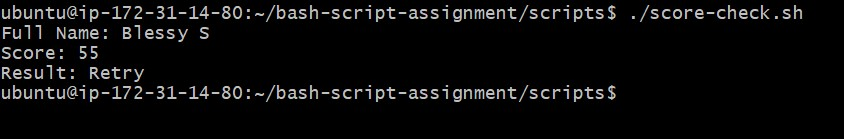

---

### Notes

Answer the following in your own words:

**1. What is the purpose of if-else in Bash?**

It give a condition .`if ` condition is true ,then it will be executed. IF condition is false ,then `else` condition will work.

---

**2. What does `-ge` mean?**

`-ge` means greater than or equal.

---

**3. Why should conditions be tested with different values?**

We need to test all the possible conditions for if condition to be true and the false condition.

---

**4. How can conditionals help in automation scripts?**

Condition helps to  take decisions inside scripts.

---

# Task 8 — Functions: Final Bash Automation Script

## Goal

Create a final Bash script using functions to organize reusable code.

### Evidence

#### Screenshot 1 — Content of `final-automation.sh`

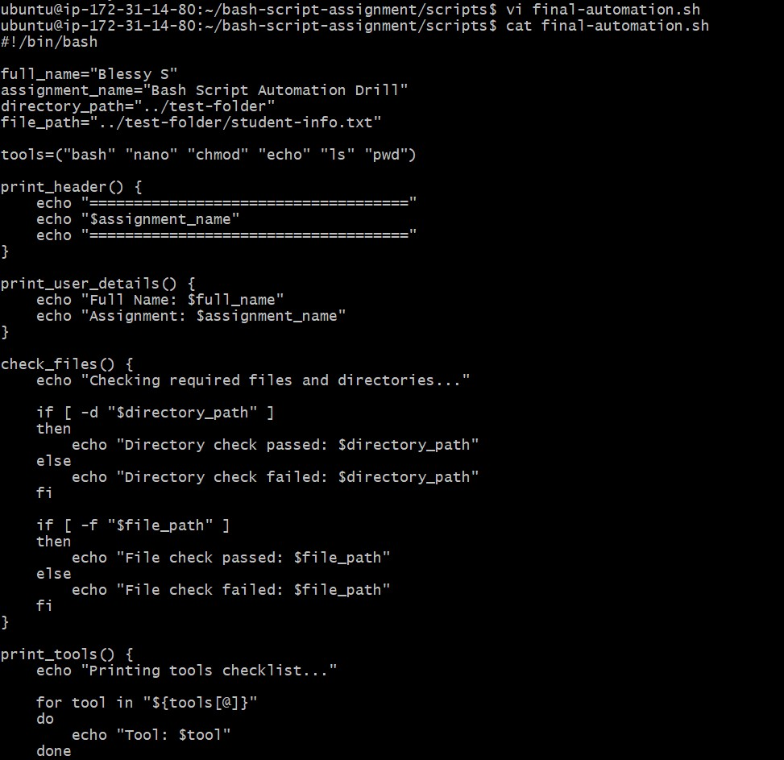

---

#### Screenshot 2 — Output of `./final-automation.sh`

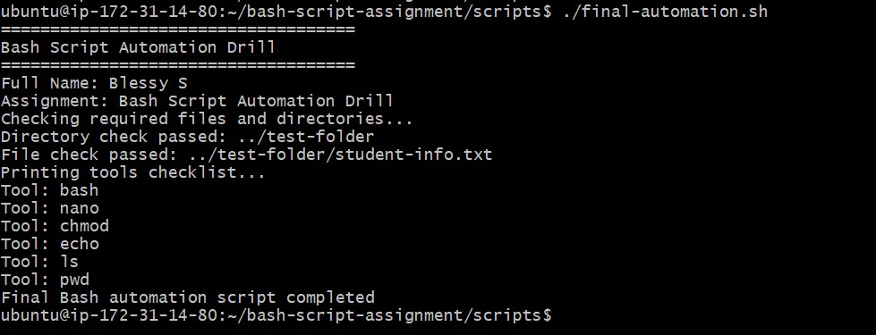

---

#### Screenshot 3 — Output of `ls -lah` showing all created scripts

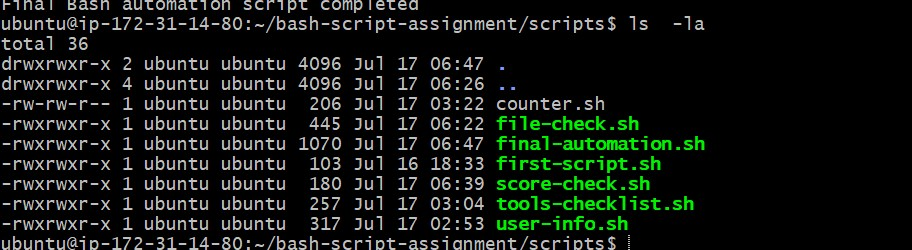

---

### Notes

Answer the following in your own words:

**1. What is a function in Bash?**

function is a block of specif commands. Users can use the function name inside the script to call them multiple times, so that adding number of commands multiple time can be avoided.
---

**2. Why are functions useful in scripts?**

Functions help us separate a large script into smaller sections. So that script become easy to read and understandable.

---

**3. Which functions did you create in this script?**

There are four functions .
1.print_header
2.print_user_details
3.check_files checks
4.print_tools 

---

**4. How does this final script combine variables, arrays, loops, conditionals, files, and functions?**

Final script uses variables to store names,assignment name, and the required paths. Array to store the tool names and a loop to print them one by one. It uses if-else conditionals with -d and -f to check the required directory and file.Functions are used to organize specific commands.
---

# LinkedIn Post (Required)

## Evidence

#### LinkedIn Post URL

Paste your LinkedIn post URL here:

`https://www.linkedin.com/posts/blessy-s-06b379269_dmibypravinmishra-devops-agenticai-share-7483780458024124417-NKlz/?utm_source=share&utm_medium=member_desktop&rcm=ACoAAEG6aBMB0zfBR9hQTWrl7i6zZCygzNyvY74`

---

#### Screenshot — Published LinkedIn post

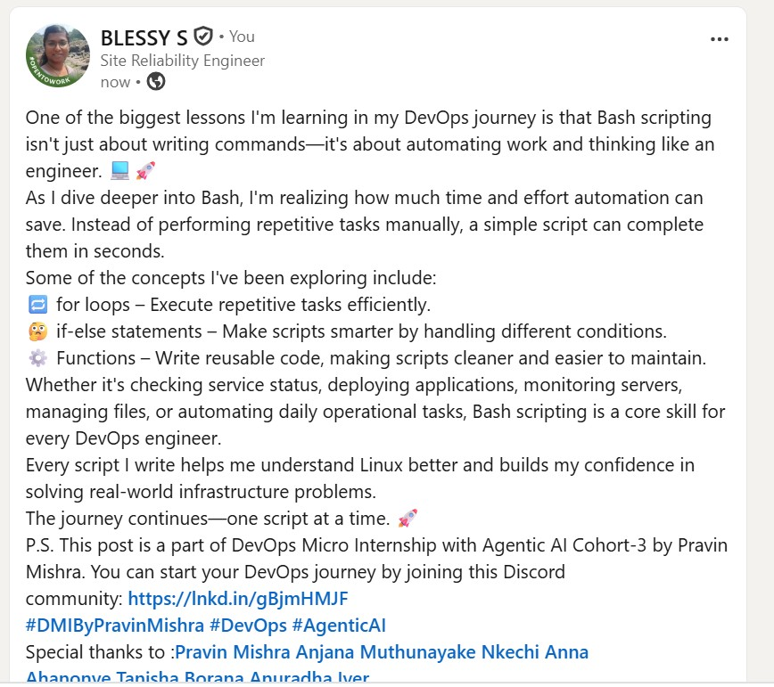

---

# Submission Instructions

- Add all required screenshots in your submission
- Full name must be visible in required screenshots
- All script files must be created and run successfully
- Required notes must be answered clearly for every task
- Do not expose sensitive information (keys, passwords, credentials)

---

# Completion Checklist

- [ ] Task 1: Environment setup verified, workspace created (Screenshots 1–2, Notes answered)
- [ ] Task 2: First script created, executed, permissions verified (Screenshots 1–3, Notes answered)
- [ ] Task 3: Variables script created and run (Screenshots 1–2, Notes answered)
- [ ] Task 4: Arrays and loops script created and run (Screenshots 1–2, Notes answered)
- [ ] Task 5: Counter loop script created and run (Screenshots 1–2, Notes answered)
- [ ] Task 6: File validation script created and run (Screenshots 1–3, Notes answered)
- [ ] Task 7: Pass/Retry conditional script tested with both values (Screenshots 1–4, Notes answered)
- [ ] Task 8: Final automation script created and run (Screenshots 1–3, Notes answered)
- [ ] All scripts run without errors
- [ ] Full Name visible in all required screenshots
- [ ] LinkedIn post published and URL submitted
- [ ] No sensitive data exposed

---

## 📌 About DMI & CloudAdvisory

DevOps Micro Internship (DMI) is a project-based DevOps program run by Pravin Mishra (The CloudAdvisory) focused on real-world execution, systems thinking, and career readiness.

It helps learners build strong DevOps foundations with hands-on experience.

---

## 📌 Resources

- 🌐 DMI Official Website: https://pravinmishra.com/dmi  
- 🎓 DevOps for Beginners (Udemy): https://www.udemy.com/course/devops-for-beginners-docker-k8s-cloud-cicd-4-projects/  
- 🎓 Agentic AI DevOps with Claude Code: https://www.udemy.com/course/ultimate-agentic-ai-devops-with-claude-code/  
- 🎓 DevOps with Claude Code: Terraform, EKS, ArgoCD & Helm: https://www.udemy.com/course/devops-with-claude-code-terraform-eks-argocd-helm/  
- ▶️ YouTube Playlist: https://www.youtube.com/playlist?list=PLFeSNDtI4Cho  
- 🔗 Pravin Mishra (LinkedIn): https://www.linkedin.com/in/pravin-mishra-aws-trainer/  
- 🏢 CloudAdvisory (LinkedIn): https://www.linkedin.com/company/thecloudadvisory/

---

*This submission is part of DevOps Micro Internship (DMI) Cohort 3 — Agentic AI Track.*