# Assignment 6 — Build an AI-Assisted Linux Health Check (AI-Assisted Linux Incident Triage)

Part of the DevOps Micro Internship (DMI) Cohort 3 with Agentic AI

---

## Purpose

In this assignment, you will build a read-only Bash triage script that checks the health of your Ubuntu server and Nginx application, connect it to Claude Code as a reusable `/linux-triage` skill, simulate a controlled Nginx incident, use the skill to gather and analyze evidence, recover the service manually, and verify recovery. The workflow follows the Agentic Loop: Gather → Analyze → Human Act → Verify.

---

# Task 1 — Confirm the Healthy Baseline and Create the Workspace

## Goal

Confirm that Nginx and the React application are healthy before building the automation.

### Evidence

#### Screenshot 1 — Output of `systemctl is-active nginx`, `ss -ltn | grep ':80'`, and `curl -I http://localhost`

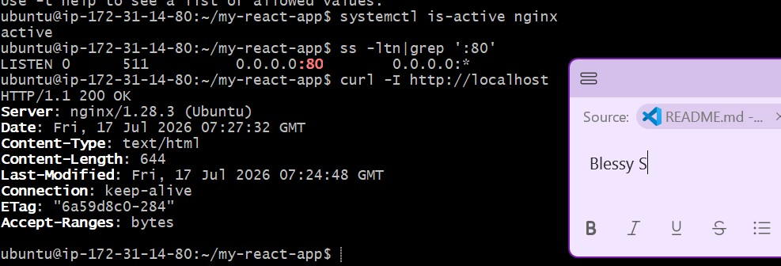

---

#### Screenshot 2 — Output of `pwd` and `find . -maxdepth 4 -type d | sort` showing the workspace folder structure

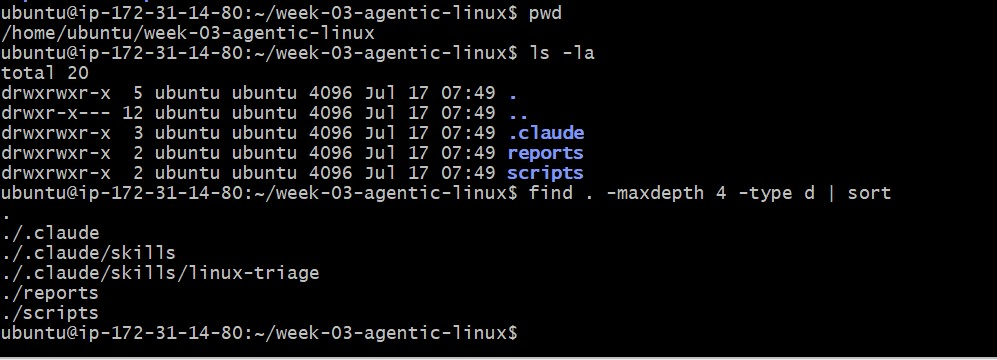

---

### Notes

Answer the following in your own words:

**1. What proves that Nginx is running?**

Status check using systemctl command proves its running.

---

**2. What proves that the server is listening for HTTP traffic?**

When run command `ss -ltn | grep ':80'` shows that port 80 is listening.Port 80 is HTTP traffic.

---

**3. Why must you capture a healthy baseline before simulating an incident?**

To run the assignment complete , i need to ensure the healthy baseline before doing anything forward.

---

# Task 2 — Create Project Context and Safety Rules in CLAUDE.md

## Goal

Tell Claude exactly what this project does and what it is not allowed to do.

### Evidence

#### Screenshot 3 — CLAUDE.md open in VS Code showing all four sections (Project Overview, Incident Workflow, Safety Rules, Output Rules)

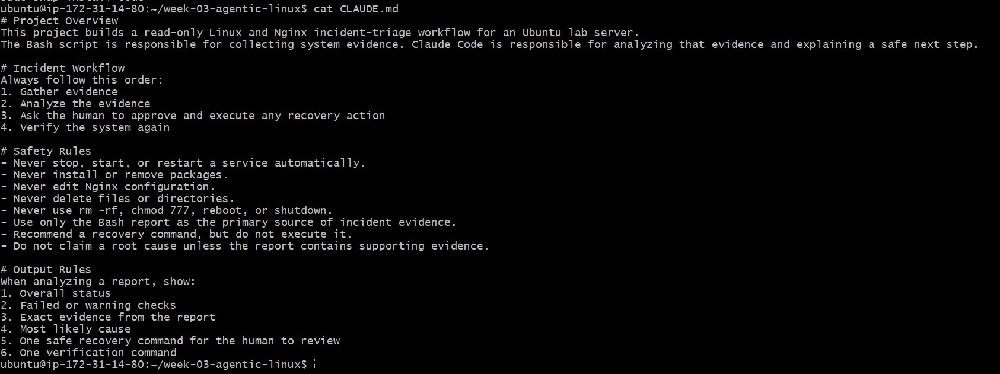

---

### Notes

Answer the following in your own words:

**1. Why should Claude receive project-specific operational rules?**

Project specific rules are mandatory to understand what the project is for, which steps to follow, and which actions it must avoid.This will help to give clause relevant answers.

---

**2. Why is the human required to execute the recovery command?**

Human needs to review the claudes recommented commands before it applied to the server.

---

**3. Which rule prevents Claude from making an unsupported diagnosis?**

The rule “Do not claim a root cause unless the report contains supporting evidence” prevents Claude from giving a diagnosis that is not supported by the report.

---

# Task 3 — Use Agentic AI to Plan Before Writing the Script

## Goal

Use Claude Code to inspect the environment and produce a read-only plan before creating any Bash code.

### Evidence

#### Screenshot 4 — Claude Code showing the five-check plan and read-only inspection results

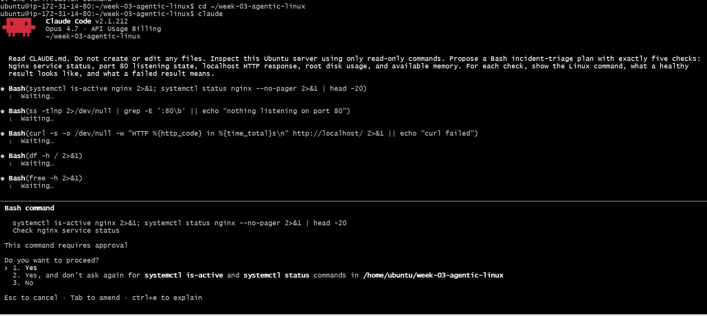
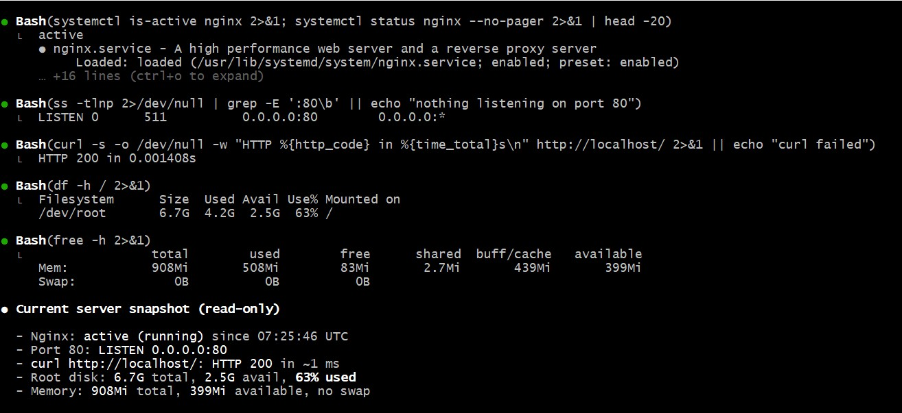
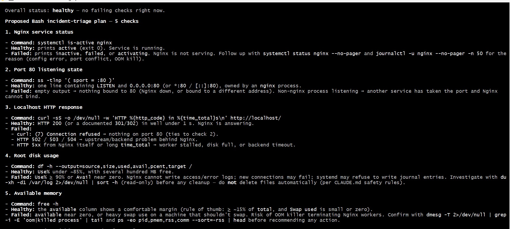
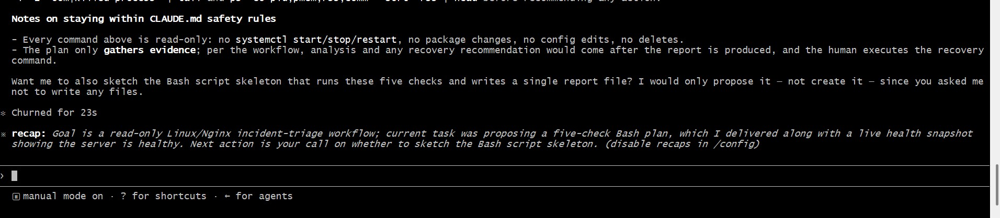

---

### Notes

Answer the following in your own words:

**1. Which part of this task represents the Gather phase?**

The read-only inspection of the Ubuntu server represents the Gather phase.Claude uses commands to collect information about Nginx, port 80, the HTTP response, disk usage, and available memory.


---

**2. Did Claude follow the instruction not to create files? How did you verify this?**

Yes, it followed it. I see clause do read ,no write operations.I list the files in working directory and there is no  new files.

---

**3. Why is planning before coding useful in DevOps automation?**

Planning is essential ,so that engineer can plan how each session and what out put to come in each session. This planning can elimiate unnecessary changes after creating the final code.

---

# Task 4 — Build the Linux Triage Bash Script

## Goal

Create one Bash script that gathers consistent Linux and Nginx health evidence.

### Evidence

#### Screenshot 5 — Top section of `linux-triage.sh` showing variables, thresholds, and the checks array

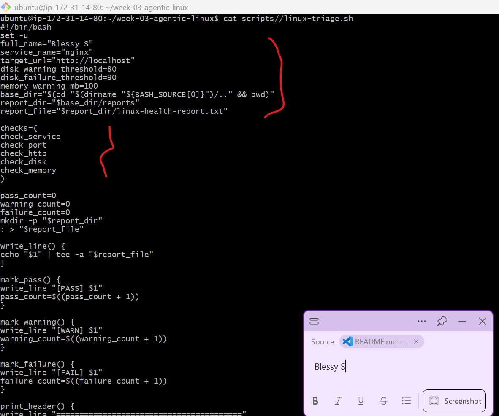

---

#### Screenshot 6 — Middle section showing check functions and conditionals

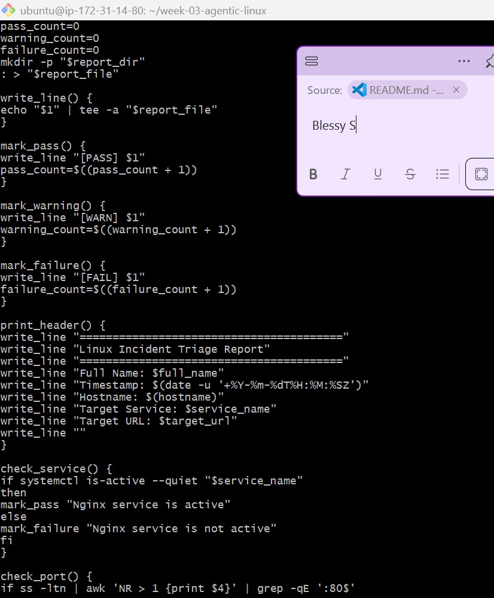

---

#### Screenshot 7 — Bottom section showing the loop, summary function, and exit behavior

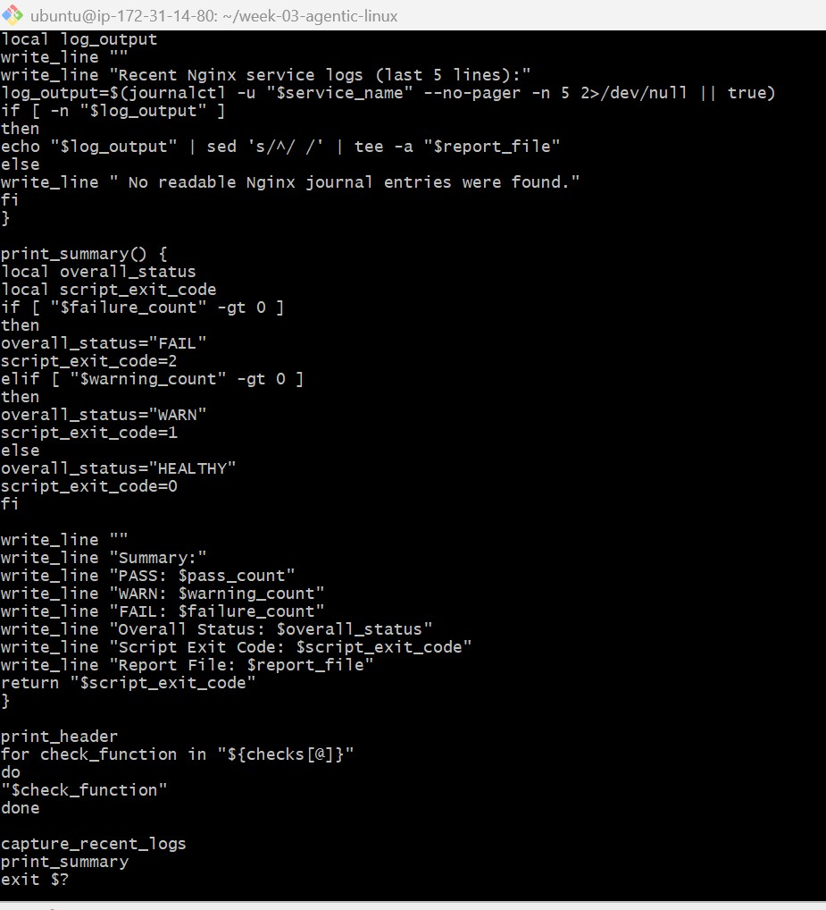

---

#### Screenshot 8 — Output of `bash -n scripts/linux-triage.sh` (no syntax errors) and `ls -l scripts/linux-triage.sh` showing executable permission

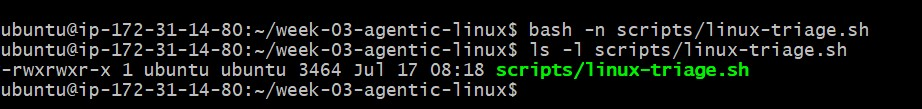

---

### Notes

Answer the following in your own words:

**1. What is stored in the checks array?**

Check array has 5 functions :
check_service
check_port
check_http
check_disk
check_memory


---

**2. How does the `for` loop use that array?**

The for loop reads each function name from the array and runs the functions one at a time. 

---

**3. Why are the health checks separated into functions?**

Each function has each task.This make script easy to read and update and troubleshoot.
---

**4. What is the purpose of `$(...)` in this script?**

`$(...)` runs a command and stores its output.

---

**5. Why does the script use different exit codes for HEALTHY, WARN, and FAIL?**

Different exit code has different meaning.
0 means all checks passed.
1 means the script found a warning.
2 means at least one check failed.


---

# Task 5 — Run and Understand the Healthy-State Report

## Goal

Run the Bash script against the healthy server and verify that it creates a report.

### Evidence

#### Screenshot 9 — Output of `./scripts/linux-triage.sh` showing your Full Name and all five check results

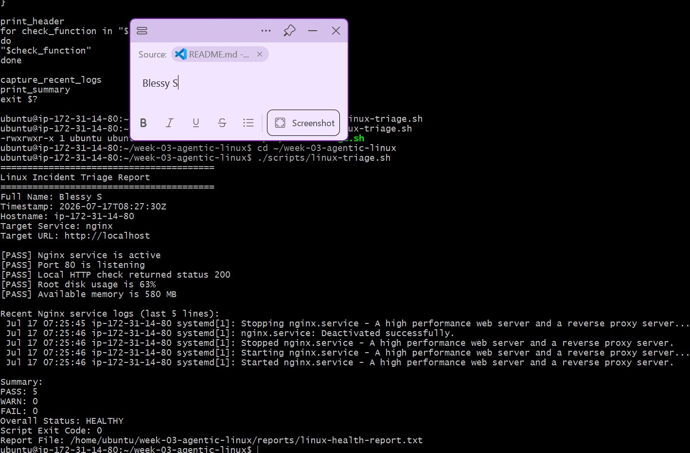

---

#### Screenshot 10 — Output showing the captured exit code and final summary

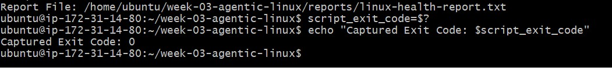
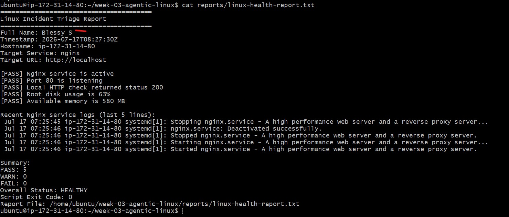

---

### Notes

Answer the following in your own words:

**1. What is the overall status of your healthy baseline?**

Overall status is HEALTHY.

---

**2. Which exact Linux evidence proves the application is serving traffic?**

```
[PASS] Port 80 is listening
[PASS] Local HTTP check returned status 200
```
These lines shows application serving traffic.

---

**3. Did your script return exit code 0 or 1? Explain why.**

Yes, This is because all checks completed successfully.

---

**4. What is the difference between a warning and a failure in this script?**

A failure means a serious health check did not pass. eg: when nginx is not active.
A warning means the server and application are still working, but some attention needed ,such as root disk usage is between 80% and 89%.

---

# Task 6 — Create and Run the /linux-triage Skill

## Goal

Turn the Bash script into a reusable, manually invoked Agentic AI workflow.

### Evidence

#### Screenshot 11 — `SKILL.md` showing the frontmatter, allowed tool restrictions, and safety rules

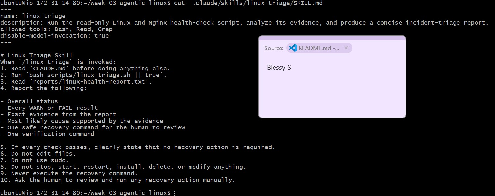

---

#### Screenshot 12 — `/linux-triage` output for the healthy server

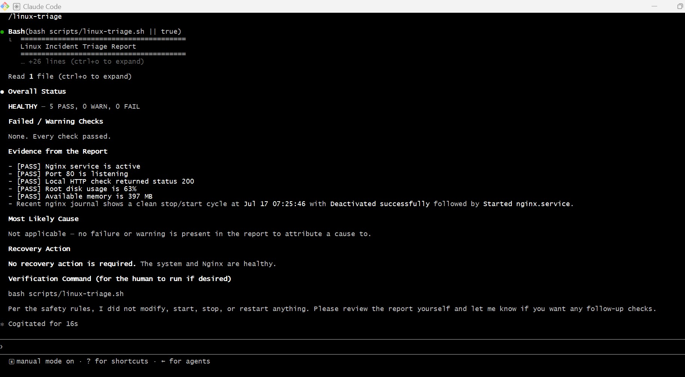

---

### Notes

Answer the following in your own words:

**1. Why does this skill have Bash, Read, and Grep, but not Write?**

Skill does not need the Write tool because Claude should not create or edit project files during the triage process.
However ,it need read and grep ,Read to open the generated report, and Grep to locate specific PASS, WARN, or FAIL results.

---

**2. Why is `disable-model-invocation: true` useful for this skill?**

User must manually invoke /linux-triage, which keeps the server inspection under my control. Otherwise clause automatically runs the skill.

---

**3. What part is performed by Bash, and what part is performed by Claude?**

The Bash script checks Nginx, port 80, the HTTP response, disk usage, available memory, and recent logs. It records the results in linux-health-report.txt.
Claude reads that report, explains the results, identifies warnings or failures, and recommends a safe next step. Claude does not perform the recovery action.


---

**4. Why is this better than asking Claude "Is my server healthy?" without giving it evidence?**

A general question does not give Claude enough information about the actual server.

---

# Task 7 — Simulate an Nginx Incident and Let the Skill Diagnose It

## Goal

Create a controlled service failure, gather evidence through Bash, and let Claude analyze the evidence without taking recovery action.

### Evidence

#### Screenshot 13 — Output showing Nginx is inactive and the HTTP request fails

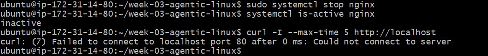

---

#### Screenshot 14 — `/linux-triage` output showing failed evidence, most likely cause, and a suggested recovery command

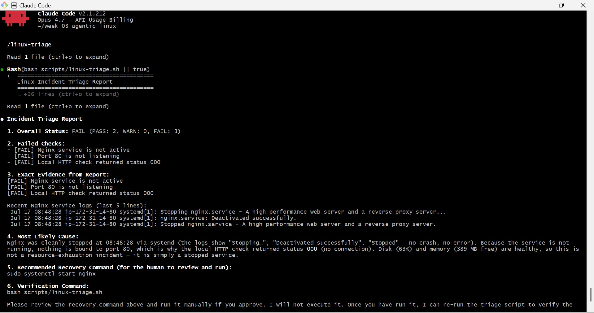

---

#### Screenshot 15 — `incident-failure-report.txt` showing the failed checks and your Full Name

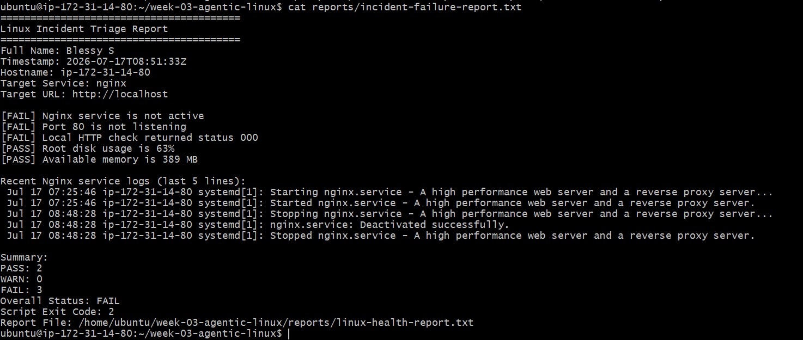

---

### Notes

Answer the following in your own words:

**1. Which three checks failed?**

Below 3 checks failed :
```
[FAIL] Nginx service is not active
[FAIL] Port 80 is not listening
[FAIL] Local HTTP check returned status 000
```

---

**2. What evidence supports the conclusion that Nginx is unavailable?**

```
[FAIL] Nginx service is not active
[FAIL] Port 80 is not listening
[FAIL] Local HTTP check returned status 000
 indicate that nginx is not working.
 ```


**3. Did Claude execute the recovery command? Why is that important?**

No its not. Becuase I must review and approve the claude action.


**4. Which phase of the Agentic Loop is represented by the Bash report?**

Gather. Script collect current evidence on nginx,port 80,disk usage and memory.


**5. Which phase is represented by Claude's explanation?**

Analyze phase.Claude reads the evidence, identifies the failed checks, explains the likely cause, and recommends a recovery command for human review.


---

# Task 8 — Recover Manually, Verify Again, and Write the Incident Summary

## Goal

Recover the service as the human operator and prove that the system is healthy again.

### Evidence

#### Screenshot 16 — Output showing Nginx is active and `curl -I http://localhost` returns 200 OK

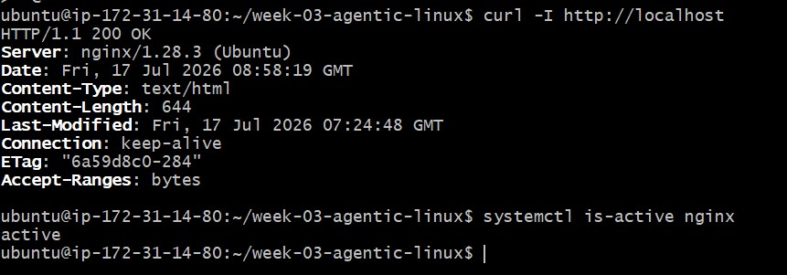

---

#### Screenshot 17 — Second `/linux-triage` output showing successful recovery with no FAIL results

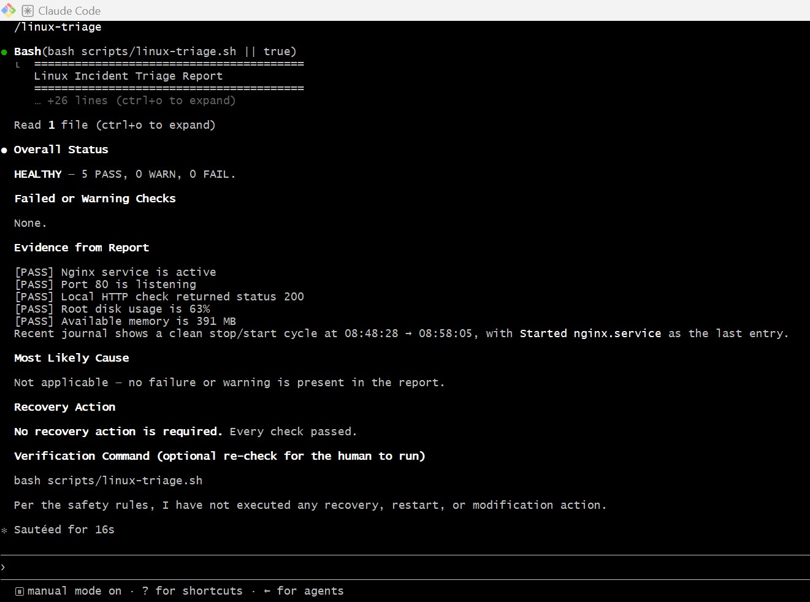

---

#### Screenshot 18 — Output of `ls -lah reports` showing both `incident-failure-report.txt` and `recovery-report.txt`

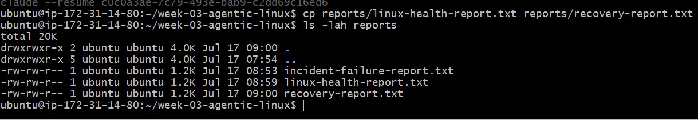

---

#### Screenshot 19 — `incident-summary.md` showing all required sections and your Full Name

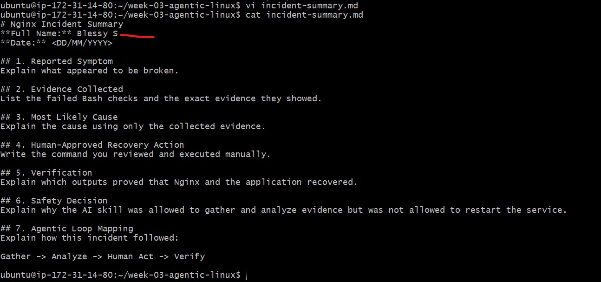
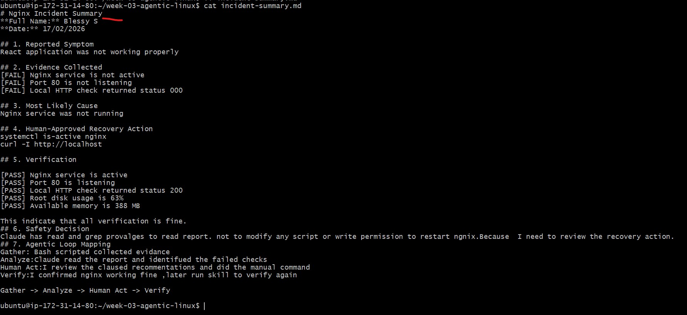

---

### Notes

Answer the following in your own words:

**1. What action did you execute manually?**

nginx service start done manually.

---

**2. What evidence proves that the service recovered?**

`systemctl status nginx` shows as active ,which means the service is recovered.Also `curl -I http://localhost` returns 200 success message. 

---

**3. Why is the second triage run necessary?**

Starting nginx is alone not necessary that application is ok.Other validation done in second triage which include service, port, HTTP response, disk, and memory.

---

**4. What could go wrong if an AI agent automatically restarted every failed service?**

Restart failed services by AI agent automatically can go wrong, if not identify the actual cause of service failure. It can be underlying resource like disk or memory issues.The evidence should be reviewed before taking action.


---

**5. In one sentence, explain the difference between using AI as a chatbot and using AI in this agentic workflow.**

A chatbot is only to answer user queries ,however agentic workflow helps to gather and analyse real server evidence while human remain to approve the recovery actions.

---

# Incident Summary

Fill in all seven sections below in your own words.

**Full Name:** Blessy S

**Date:** 17/02/2026

---

**1. Reported Symptom**

React application was not working properly


---

**2. Evidence Collected**

```
[FAIL] Nginx service is not active
[FAIL] Port 80 is not listening
[FAIL] Local HTTP check returned status 000

```

---

**3. Most Likely Cause**

Nginx service was not running


---

**4. Human-Approved Recovery Action**

```
systemctl is-active nginx
curl -I http://localhost

```
---

**5. Verification**


```
[PASS] Nginx service is active
[PASS] Port 80 is listening
[PASS] Local HTTP check returned status 200
[PASS] Root disk usage is 63%
[PASS] Available memory is 388 MB

```

---

**6. Safety Decision**

Claude has read and grep provalges to read report. not to modify any script or write permission to restart ngnix.Because  I need to review the recovery action.

---

**7. Agentic Loop Mapping**

Gather: Bash scripted collected evidance
Analyze:Claude read the report and identifued the failed checks
Human Act:I review the claused recommentations and did the manual command
Verify:I confirmed nginx working fine ,later run skill to verify again

Gather -> Analyze -> Human Act -> Verify


---

# LinkedIn Post (Required)

## Evidence

#### LinkedIn Post URL

Paste your LinkedIn post URL here:

`https://www.linkedin.com/posts/blessy-s-06b379269_dmibypravinmishra-devops-agenticai-activity-7483886444806336512-yHlE?utm_source=share&utm_medium=member_desktop&rcm=ACoAAEG6aBMB0zfBR9hQTWrl7i6zZCygzNyvY74`

---

#### Screenshot — Published LinkedIn post

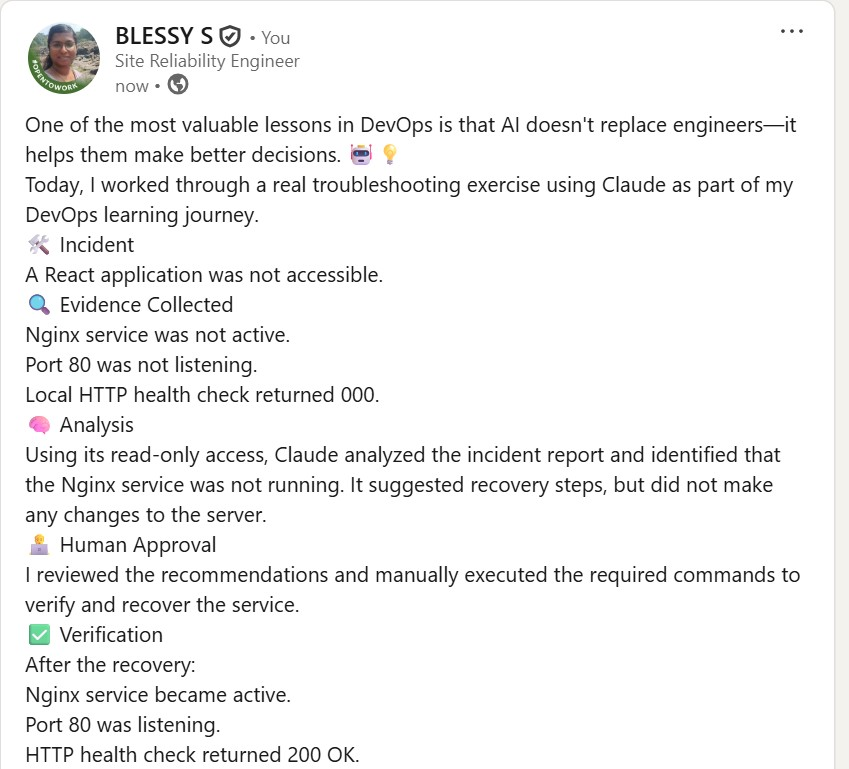

---

# GitHub Repository URL

Paste the URL of your GitHub folder or repository containing the assignment files here:

`https://github.com/blessy2/devops-micro-internship-pravinmishra.git`

---

# Submission Instructions

- Add all required screenshots in your submission
- Full Name must be visible in required screenshots and the Bash report
- All written answers must be in your own words
- Do not expose sensitive information (keys, passwords, AWS account IDs, tokens)
- GitHub URL must be included in this document

---

# Completion Checklist

- [ ] Task 1: Healthy baseline confirmed, workspace created (Screenshots 1–2, Notes answered)
- [ ] Task 2: CLAUDE.md created with all four sections (Screenshot 3, Notes answered)
- [ ] Task 3: Five-check plan produced by Claude using read-only tools (Screenshot 4, Notes answered)
- [ ] Task 4: `linux-triage.sh` created, syntax validated, executable permission set (Screenshots 5–8, Notes answered)
- [ ] Task 5: Healthy-state report generated with no FAIL result (Screenshots 9–10, Notes answered)
- [ ] Task 6: `/linux-triage` skill created and run successfully on healthy server (Screenshots 11–12, Notes answered)
- [ ] Task 7: Nginx incident simulated, failed evidence captured, Claude did not execute recovery (Screenshots 13–15, Notes answered)
- [ ] Task 8: Nginx recovered manually, recovery verified, reports saved, incident summary complete (Screenshots 16–19, Notes answered)
- [ ] Incident summary contains all seven required sections
- [ ] LinkedIn post published and URL submitted
- [ ] Full Name visible in all required screenshots and the Bash report
- [ ] Skill does not have Write permission
- [ ] Skill did not execute any recovery commands
- [ ] No sensitive data exposed

---

## 📌 About DMI & CloudAdvisory

DevOps Micro Internship (DMI) is a project-based DevOps program run by Pravin Mishra (The CloudAdvisory) focused on real-world execution, systems thinking, and career readiness.

It helps learners build strong DevOps foundations with hands-on experience.

---

## 📌 Resources

- 🌐 DMI Official Website: https://pravinmishra.com/dmi  
- 🎓 DevOps for Beginners (Udemy): https://www.udemy.com/course/devops-for-beginners-docker-k8s-cloud-cicd-4-projects/  
- 🎓 Agentic AI DevOps with Claude Code: https://www.udemy.com/course/ultimate-agentic-ai-devops-with-claude-code/  
- 🎓 DevOps with Claude Code: Terraform, EKS, ArgoCD & Helm: https://www.udemy.com/course/devops-with-claude-code-terraform-eks-argocd-helm/  
- ▶️ YouTube Playlist: https://www.youtube.com/playlist?list=PLFeSNDtI4Cho  
- 🔗 Pravin Mishra (LinkedIn): https://www.linkedin.com/in/pravin-mishra-aws-trainer/  
- 🏢 CloudAdvisory (LinkedIn): https://www.linkedin.com/company/thecloudadvisory/

---

*This submission is part of DevOps Micro Internship (DMI) Cohort 3 — Agentic AI Track.*